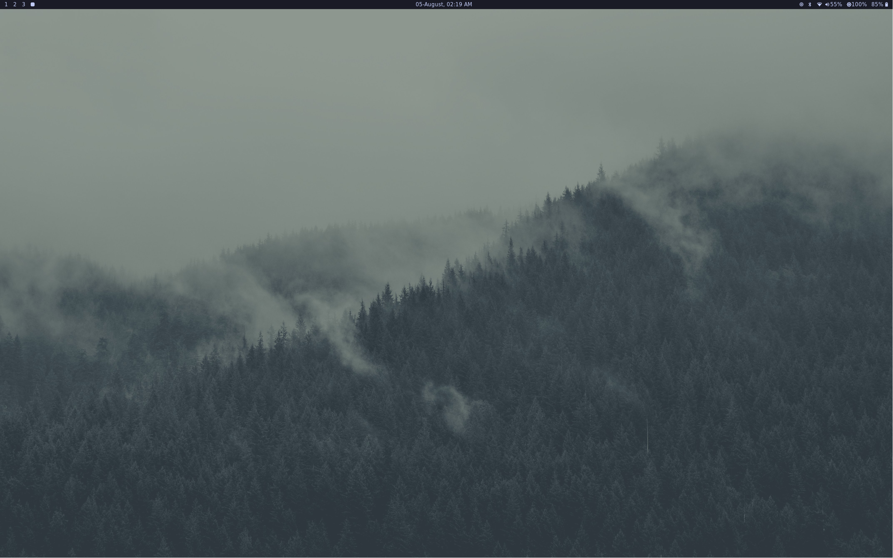
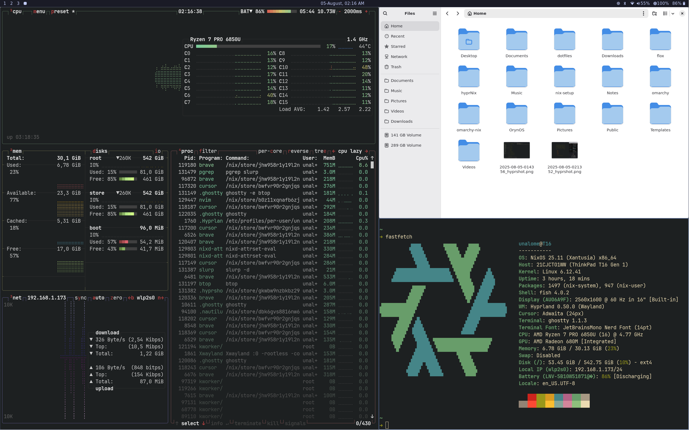
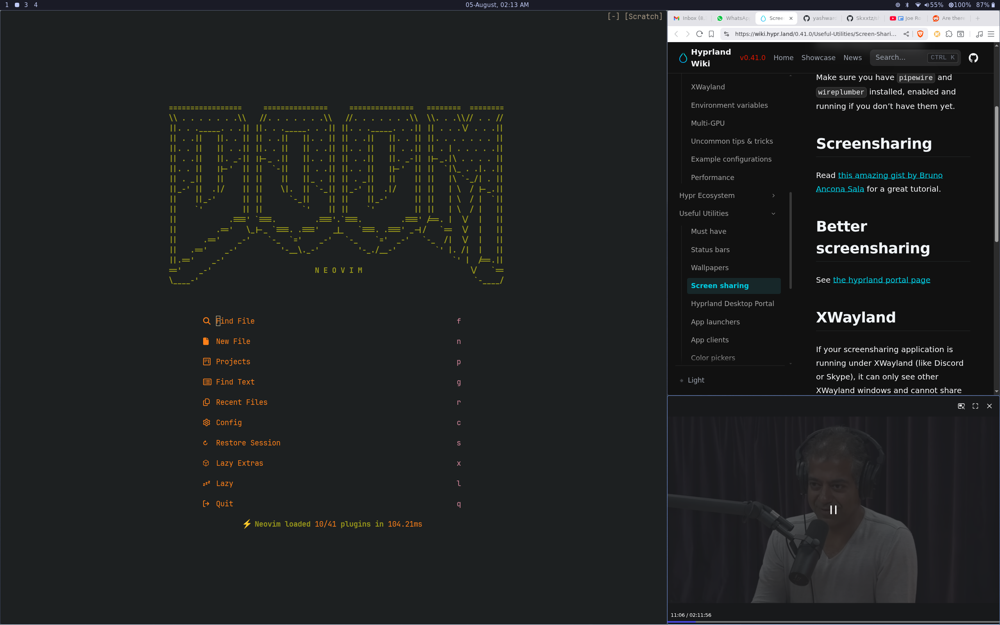
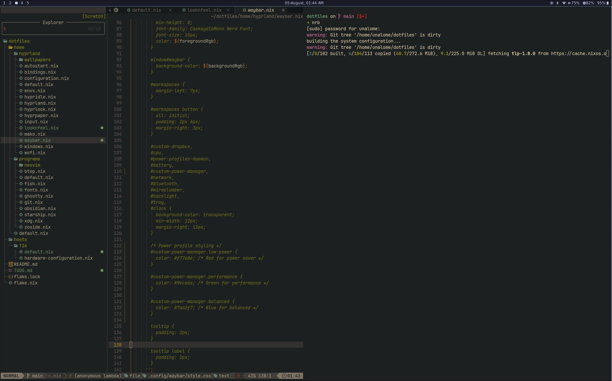

# unalome's NixOS Dotfiles

A modern, opinionated NixOS configuration featuring Hyprland window manager with a complete desktop environment setup.

## Screenshots






## Table of Contents
- [Overview](#overview)
- [Quick Start](#quick-start)
- [Applications](#applications)
- [Keyboard Shortcuts](#keyboard-shortcuts)
- [Configuration Structure](#configuration-structure)
- [Customization](#customization)
- [Resources](#resources)

## Overview

This dotfiles repository provides a complete NixOS desktop environment featuring:
- **Hyprland** - Modern tiling Wayland compositor
- **Tokyo Night** theme with custom colors
- **Waybar** - Customizable status bar
- **Ghostty** - GPU-accelerated terminal emulator
- **Neovim** - Configured with LazyVim
- **Audio/Video** - PipeWire with multimedia controls
- **Security** - Hyprlock screen locker with idle management

## Quick Start

### Prerequisites
- NixOS installed
- Flakes enabled in your Nix configuration

### Installation
```bash
# Clone the repository
git clone https://github.com/your-username/dotfiles.git ~/dotfiles
cd ~/dotfiles

# Build and switch to the configuration
sudo nixos-rebuild switch --flake .#T16

# Or for standalone home-manager
home-manager switch --flake .#unalome
```

## Applications

### Core Applications
- **Terminal**: Ghostty (GPU-accelerated)
- **Browser**: Brave (default), Chromium (available)
- **File Manager**: Nautilus
- **Editor**: Neovim with LazyVim configuration
- **Launcher**: Wofi (application launcher)
- **Audio**: PulseAudio with PipeWire backend
- **Bluetooth**: Blueberry manager
- **Network**: NetworkManager with GUI applet

### Development Tools
- **Git** - Configured with user settings
- **Fish Shell** - User-friendly shell with Starship prompt
- **btop** - Modern system resource monitor
- **LazyGit** - Terminal UI for Git operations

## Keyboard Shortcuts

### Hyprland Window Management

#### Basic Window Control
| Shortcut | Action |
|----------|---------|
| `Super + Q` | Close active window |
| `Super + Backspace` | Close active window (alternative) |
| `Super + V` | Toggle floating mode |
| `Super + J` | Toggle split direction |
| `Super + P` | Toggle pseudo-tiling |
| `Super + Shift + F` | Toggle fullscreen |

#### Window Navigation
| Shortcut | Action |
|----------|---------|
| `Super + ←/→/↑/↓` | Move focus between windows |
| `Super + Shift + ←/→/↑/↓` | Swap windows |
| `Super + -/=` | Resize window horizontally |
| `Super + Shift + -/=` | Resize window vertically |

#### Workspace Management
| Shortcut | Action |
|----------|---------|
| `Super + 1-9` | Switch to workspace 1-9 |
| `Super + 0` | Switch to workspace 10 |
| `Super + Shift + 1-9` | Move window to workspace 1-9 |
| `Super + ,/.` | Switch to previous/next workspace |
| `Super + S` | Toggle special workspace |
| `Super + Shift + S` | Move window to special workspace |

#### Mouse Actions
| Shortcut | Action |
|----------|---------|
| `Super + Left Click + Drag` | Move window |
| `Super + Right Click + Drag` | Resize window |
| `Super + Scroll` | Switch workspaces |

### Application Shortcuts
| Shortcut | Application |
|----------|-------------|
| `Super + Space` | Application launcher (Wofi) |
| `Super + Return` | Terminal (Ghostty) |
| `Super + T` | Terminal (alternative) |
| `Super + B` | Browser (Brave) |
| `Super + E` | File manager (Nautilus) |
| `Super + N` | Neovim editor |

### Session Management
| Shortcut | Action |
|----------|---------|
| `Super + Escape` | Lock screen |
| `Super + Shift + Escape` | Exit Hyprland |
| `Super + Ctrl + Escape` | Reboot system |
| `Super + Shift + Ctrl + Escape` | Power off system |

### Screenshots & Tools
| Shortcut | Action |
|----------|---------|
| `Print Screen` | Screenshot region |
| `Shift + Print Screen` | Screenshot window |
| `Ctrl + Print Screen` | Screenshot output |
| `Super + Print Screen` | Color picker |
| `Ctrl + Super + V` | Clipboard manager |

### Media Controls
| Shortcut | Action |
|----------|---------|
| `Volume Up/Down` | Adjust system volume |
| `Volume Mute` | Toggle mute |
| `Mic Mute` | Toggle microphone mute |
| `Brightness Up/Down` | Adjust screen brightness |
| `Media Play/Pause` | Control media playback |
| `Media Next/Prev` | Skip tracks |

### Ghostty Terminal Shortcuts

#### Window Management
| Shortcut | Action |
|----------|---------|
| `Ctrl + Shift + Q` | Quit terminal |
| `Alt + F4` | Close window |
| `Ctrl + Shift + N` | New window |

#### Tab Management
| Shortcut | Action |
|----------|---------|
| `Ctrl + Shift + T` | New tab |
| `Ctrl + W` | Close tab |
| `Ctrl + Tab` | Next tab |
| `Ctrl + Shift + Tab` | Previous tab |
| `Alt + 1-8` | Go to tab 1-8 |
| `Alt + 9` | Go to last tab |

#### Split Management
| Shortcut | Action |
|----------|---------|
| `Alt + E` | Split down |
| `Alt + V` | Split right |
| `Alt + W` | Close split |
| `Alt + H/J/K/L` | Navigate splits |
| `Ctrl + Shift + ↑/↓/←/→` | Resize splits |

#### Text & Selection
| Shortcut | Action |
|----------|---------|
| `Ctrl + Shift + C` | Copy to clipboard |
| `Ctrl + Shift + V` | Paste from clipboard |
| `Ctrl + Shift + A` | Select all |
| `Ctrl + +/-` | Increase/decrease font size |
| `Ctrl + 0` | Reset font size |

## Configuration Structure

```
dotfiles/
├── flake.nix                 # Main flake configuration
├── hosts/T16/               # Host-specific configuration
│   ├── default.nix          # System configuration
│   └── hardware-configuration.nix
└── home/                    # Home Manager configuration
    ├── default.nix          # Main home configuration
    ├── programs/            # Application configurations
    │   ├── ghostty.nix      # Terminal configuration
    │   ├── neovim/          # Neovim setup with LazyVim
    │   ├── fish.nix         # Shell configuration
    │   ├── git.nix          # Git settings
    │   └── ...
    └── hyprland/           # Hyprland WM configuration
        ├── default.nix      # Main Hyprland config
        ├── bindings.nix     # Keyboard shortcuts
        ├── windows.nix      # Window rules
        ├── waybar.nix      # Status bar configuration
        ├── autostart.nix   # Startup applications
        └── ...
```
## Resources

This configuration draws inspiration from several excellent NixOS and Hyprland setups:

- **[OrynOS](https://github.com/OrynVail/OrynOS)** - A declarative, high-performance NixOS configuration built with Hyprland, TTY login, and modular design
- **[Omarchy](https://github.com/basecamp/omarchy/tree/master)** - Opinionated Arch/Hyprland Setup that turns a fresh Arch installation into a fully-configured, beautiful, and modern web development system
- **[omarchy-nix](https://github.com/henrysipp/omarchy-nix)** - NixOS version of the Omarchy configuration

## Contributing

Feel free to fork this repository and adapt it to your needs. If you find improvements or fixes, pull requests are welcome!

## License

This configuration is provided as-is for educational and personal use. 